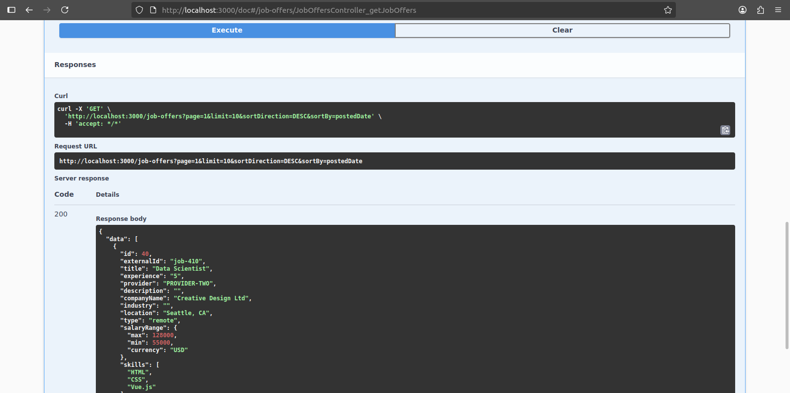
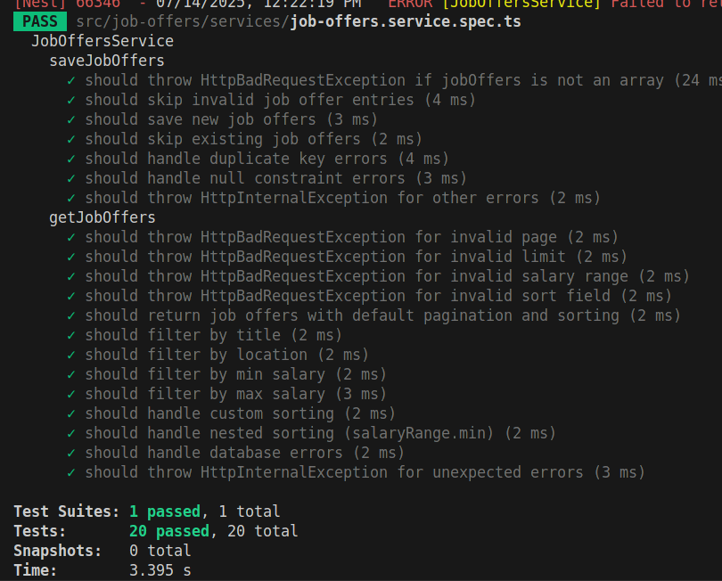

# Job Offers service

Welcome to the Job Offers API! This documentation provides an overview of the available endpoints, configurations, and setup details.

## Environment Configuration

The application uses a `.env-sample` file for environment variables:

- Server runs on port `3000` (configured via `PORT=3000`)
- Uses PostgreSQL with host `localhost`, port `5432`, database name `mydb`, username `user`, and password `password`
- Logging level can be adjusted via `LOG_LEVEL`
- A cron job is scheduled with a string defined by `JOB_RETRIEVAL_CRON_STRING="*/10 * * * * *"`

## Dependencies and Services

- **Database**: PostgreSQL (via Docker Compose, accessible on port 5432)
- **Cache**: Redis (via Docker Compose, accessible on port 6379)
- **TypeORM**: Handles ORM interactions with PostgreSQL
- **NestJS Schedule Module**: Manages scheduled cron jobs (`JobOffersCronjob`)
- **Controllers**: `JobOffersController` manages API endpoints for job offers
- **Services**: `JobOffersService` contains core business logic
- **Repositories**: `JobOfferRepository` interacts with database entities
- **Transformers**: `TransformerHandler` handles data transformations
- **Error Handling**: Custom errors like `HttpInvalidMethodException` and database error catchers for constraint violations

## API Endpoints


### Get Job Offers

- **URL**: `/job-offers` (GET)
- **Description**: Fetches a list of job offers with optional filtering, pagination, and sorting

#### Query Parameters

| Name | Type | Required | Description | Examples |
|-----------------|----------|----------|----------------------------------------------------------|----------------------------------|
| `title` | string | no | Filter by job title | "Software Engineer" |
| `location` | string | no | Filter by location | "New York" |
| `minSalary` | number | no | Filter by minimum salary | 50000 |
| `maxSalary` | number | no | Filter by maximum salary | 150000 |
| `page` | number | no | Page number (default 1) | 1 |
| `limit` | number | no | Items per page (default 10) | 10 |
| `sortBy` | string | no | Field to sort by (`title`, `companyName`, `location`, `postedDate`, `salaryRange.min`, `salaryRange.max`) | "postedDate" |
| `sortDirection` | string | no | Sorting order (`ASC` or `DESC`, default `DESC`) | "ASC" |

#### Response

Returns an object containing:

- `data`: Array of `JobOfferEntity`
- `total`: Total number of job offers matching criteria
- `page`: Current page
- `limit`: Items per page

## Cron Job

- The `JobOffersCronjob` runs periodically based on the scheduled cron string (default `"*/10 * * * * *"`)
- Fetches data from external API(s) and updates the database accordingly

## Local Development

- Use `docker-compose.yml` to set up PostgreSQL and Redis services locally
- Ensure environment variables match your setup

```shell
npm run start
```

## Error Handling

- Custom exceptions like `HttpInvalidMethodException` may be thrown for invalid API requests
- Database errors such as unique violations are caught and translated into HTTP 400 responses

For further details, consult the respective source files in the `src` directory or visit [localhost:3000/doc](http://localhost:3000/doc) for generated API documentation if available.

## Automatic Testing

For automated testing for predefine service following command would be best choice.

```shell
npm run test
```

